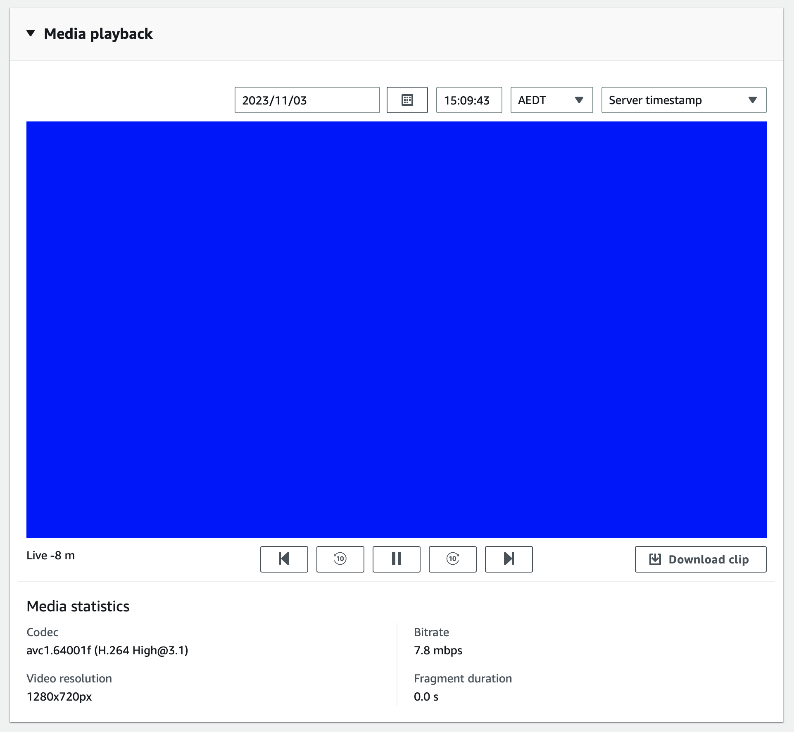

# AWS Kinesis Video Stream PutMedia Python Sample

## Prerequisites

- Python3
- ffmpeg (for generating sample video)
- AWS Account

## How to run

```sh
export AWS_ACCESS_KEY_ID="REPLACE_ME"
export AWS_SECRET_ACCESS_KEY="REPLACE_ME"
export STREAM_NAME="REPLACE_ME" # will be created if it doesn't exist
export AWS_DEFAULT_REGION="ap-southeast-2"
export VIDEO_FILEPATH="Big_Buck_Bunny_1080_10s_1MB.webm"

python3 -m venv venv
source venv/bin/activate
pip install -r requirements.txt

python3 main.py
```

## What it should look like



## Links

- [Amazon AWS Kinesis Video Boto GetMedia/PutMedia](https://stackoverflow.com/a/59551573)
