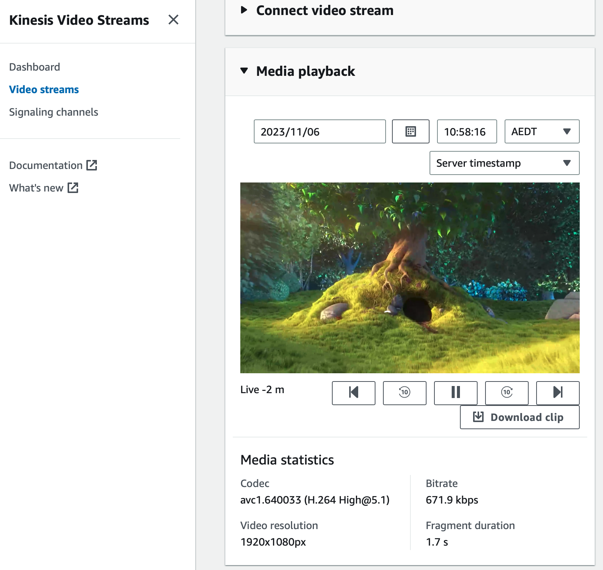

# AWS Kinesis Video Stream PutMedia Python Sample

## Prerequisites

- Python3
- AWS Account

## How to run

```sh
export AWS_ACCESS_KEY_ID="REPLACE_ME"
export AWS_SECRET_ACCESS_KEY="REPLACE_ME"
export STREAM_NAME="REPLACE_ME" # will be created if it doesn't exist
export AWS_DEFAULT_REGION="ap-southeast-2"
export VIDEO_FILEPATH="Big_Buck_Bunny_1080_10s_1MB.mkv"

python3 -m venv venv
source venv/bin/activate
pip install -r requirements.txt

python3 main.py
```

## Encode the sample video

If you use the .webm, you will get an error like this in the AWS Kinesis Video Stream console media playback:

```
Missing codec private data error
The fragment did not contain any codec private data. Ensure that the producer is generating valid codec private data.
```

So you need to encode it with ffmpeg:

`ffmpeg -i Big_Buck_Bunny_1080_10s_1MB.webm -c:v libx264 -preset veryslow -crf 40 -c:a copy Big_Buck_Bunny_1080_10s_1MB.mkv`

## What it should look like




## Links

- [Amazon AWS Kinesis Video Boto GetMedia/PutMedia](https://stackoverflow.com/a/59551573)
- [H.264 Video Encoding Guide](https://trac.ffmpeg.org/wiki/Encode/H.264)  
